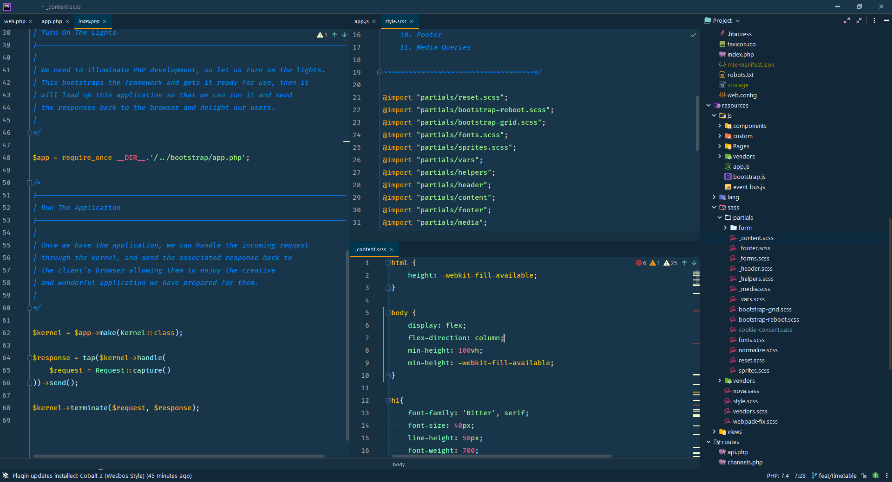

# Cobalt2 Theme for Jetbrains

Remake of [Wesbos' Cobalt2 Theme](https://github.com/wesbos/cobalt2-vscode) for Jetbrans IDE.

Adjusted with PhpStorm for (X)HTML, CSS/SASS, JS, PHP, JSON, YML extensions.

## Install
- Settings > Plugins > Install Plugin from disk ... > Select "Cobalt2_Wesbos.jar"
